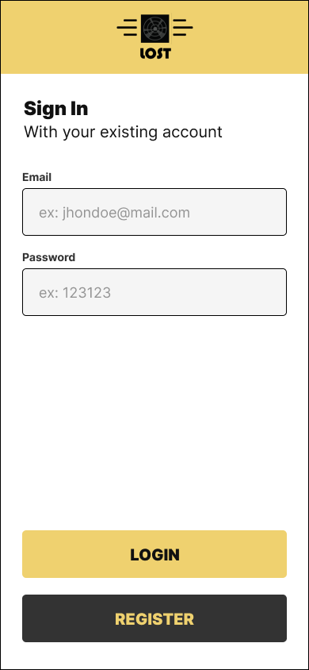
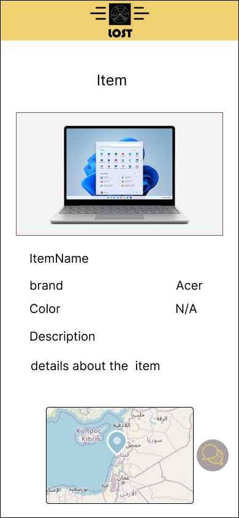
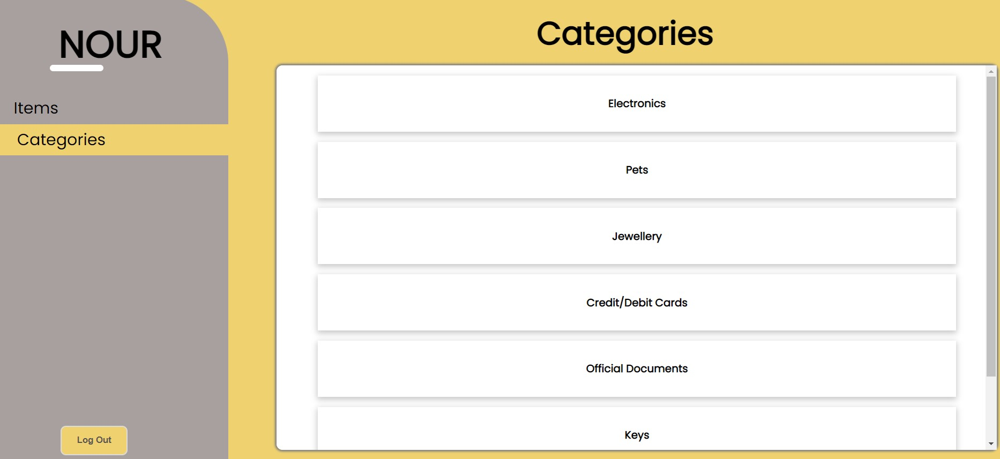

<div align="center">
  
  
  > Hello world! This is the project’s summary that describes the project plain and simple, limited to the space available. 

**[PROJECT PHILOSOPHY](#project-philosophy) • [WIREFRAMES](#wireframes) • [TECH STACK](#tech-stack) • [IMPLEMENTATION](#implementation) • [HOW TO RUN?](#how-to-run)**
</div>


<div align="center">
  
</div>

  > Lost is a lost and found application that will help people who had found an object to publish this object with its
  specifications, and users who have lost their stuff can find them with application by showin similar items.
  
  ### User Stories
  - As a user, I found a lost Item and want to publish it to reach its owner.
  - As a user, I want to post the lost item by choosing in which category it is, then entering its specification and adding its image.
  - As a user, I want to check the lost items I posted and delete posts when the owner is found.
  - As a user, I lost an item in a public place and can't find it.
  - As a user, I want to search for my lost item and check if my item is published.
  - As a user searching for his lost item, I will enter the category of this item and similar items will be displayed.
  - As a user, I want to contact  the person who found my item  by pressing the floating button and it will redirect me to the chat.
  - As an admin, I want to see the posted items in the mobile application.
  - As an admin, I want to add a new type of category so users can choose what re the posting or searching for.
  
  <br><br>  

  <div align="center">
    
  </div>
  <br>
  
> This design was planned before on paper, then moved to Figma app for the fine details.
Note that i didn't use any styling library or theme, all from scratch and using pure css modules

<table align="center" style="text-align: center;">
  <tr>
    <td>
      <h2>Login Page</h2>
    </td>
    <td>
      <h2>Choosing what are you doing</h2>
    </td>
  </tr>

  <tr>
    <td></td>
    <td></td>

  </tr>
  <tr>
    <td>
      <h2>Choosing Category</h2>
    </td>
    <td>
      <h2>Passing Specs of found object</h2>
    </td>
  </tr>

  <tr>
    <td></td>
    <td></td>

  </tr>
  <tr>
    <td>
      <h2>Similar Items</h2>
    </td>
    <td>
      <h2>Item Data</h2>
    </td>
  </tr>

  <tr>
    <td></td>
    <td></td>

  </tr>

</table>

<div align="center">

  </div>
  
  <br><br>


- This project uses the Flutter app development framework. Flutter is a cross-platform hybrid app development platform
    which allows us to use a single codebase for apps on mobile, desktop, and the web.
- For storing the database, the app uses Mongooose ODM to store all data.
 
- For implementing the realtime chat Firebase is used to store conversations between users.
 
<br>


> Using the above mentioned tech stacks and the wireframes build with figma from the user sotries we have, the implementation of the app is shown as below, these are screenshots from the real app.

<br>


<div align="center">

  </div>
<table align="center" style="text-align: center;">
  <tr>
    <td>
      <h2>Login</h2>
    </td>
    <td>
      <h2>Register</h2>
    </td>

  <tr>
    <td>
      
    </td>
    <td>
      
    </td>
  </tr>
  <tr>
    <td>
      <h2>Welcome</h2>
    </td>
    <td>
      <h2>Categories</h2>
    </td>
  </tr>
  <tr>
    <td>
      
    </td>
    <td>
      
    </td>
  </tr>
  <tr>
    <td>
      <h2>Posting lost item</h2>
    </td>
    <td>
      <h2>Showing similar items</h2>
    </td>
  </tr>
  <tr>
    <td>
      
    </td>
    <td>
      
    </td>

  </tr>
  <tr><td><h2>Item post</h2></td></tr>
  <tr>
    <td>
      
    </td>

  </tr>

</table>
<br><br>
<table style="text-align: center;">
  <tr>
    <td>
      <h2>This is the admin web app</h2>
    </td>
  </tr>
  <tr>
    <td></td>
  </tr>
</table>
<br><br>

<div align="center">
  
    </div>

### Installation
 >Download the repository as zib than exctract it or clone it
 ```sh
   git clone https://github.com/NoureddineAbouZahr/Lost.git
   ```

   > In the AdminFrontend directory  to install all packages and the same as in the Backend directory
   ```sh 
   npm install
   ```
   >Rename .env.sample to .env and set your secret token and the MongoDB URI to get connected 


### Run the applications

> Now to connect to the data base you should run the command 
```sh
node index.js
```


> Then to run the admin app change directory to the admin folder the runthe    
```sh
npm start
 ```  
>Then to run the mobile app you hove to open folder mobile app in android studio and connect your phone with usb
    debugging to install the app the update in utils the ip address of the local host to get access to database and change the ip address to your local ip adress
