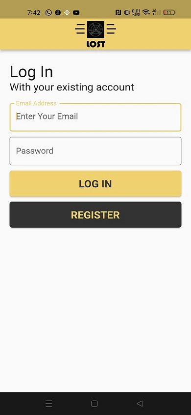

  
  
  > Hello world! This is the project’s summary that describes the project plain and simple, limited to the space available. 

**[PROJECT PHILOSOPHY](#project-philosophy) • [WIREFRAMES](#wireframes) • [TECH STACK](#tech-stack) • [IMPLEMENTATION](#implementation) • [HOW TO RUN?](#how-to-run)**

  

  > Lost is a lost and found application that will help people who had found an object to publish this object with its
  specifications, and users who have lost their stuff can find them with application by showin similar items.
  
  ### User Stories
  - As a user, I found a lost Item and want to publish it to reach its owner.
  - As a user, I want to search for my lost item and check if my item is    published.
  - As a user, I want to contact the person who published my lost item to get it back.

      

  

    
  

<table align="center" style="text-align: center;">
  <tr>Implementation</tr>
  <tr>
    <td>
      <h1>Login Page</h1>
    </td>
    <td>
      <h1>Choosing what are you doing</h1>
    </td>
  </tr>

  <tr>
    <td></td>
    <td></td>

  </tr>
  <tr>
    <td>
      <h1>Choosing Category</h1>
    </td>
    <td>
      <h1>Passing Specs of found object</h1>
    </td>
  </tr>

  <tr>
    <td></td>
    <td></td>

  </tr>
  <tr>
    <td>
      <h1>Similar Items</h1>
    </td>
    <td>
      <h1>Item Data</h1>
    </td>
  </tr>

  <tr>
    <td></td>
    <td></td>

  </tr>

</table>
<ul>
  <li>
    This project uses the Flutter app development framework. Flutter is a cross-platform hybrid app development platform
    which allows us to use a single codebase for apps on mobile, desktop, and the web.
  </li>
  <li>
    For storing the database, the app uses MongoDb for items and firebase for the realtime chat
  </li>
  <li>
</ul>
  

> Using the above mentioned tech stacks and the wireframes build with figma from the user sotries we have, the
implementation of the app is shown as below, these are screenshots from the real app

<table align="center" style="text-align: center;">
  <tr>Some Screenshots of the implemented design in the mobile application</tr>
  <tr>
    <td>
      <h1>Login</h1>
    </td>
    <td>
      <h1>Register</h1>
    </td>

  <tr>
    <td>
      
    </td>
    <td>
      
    </td>
  </tr>
  <tr>
    <td>
      <h1>Welcome</h1>
    </td>
    <td>
      <h1>Categories</h1>
    </td>
  </tr>
  <tr>
    <td>
      
    </td>
    <td>
      
    </td>
  </tr>
  <tr>
    <td>
      <h1>Posting lost item</h1>
    </td>
    <td>
      <h1>Showing similar items</h1>
    </td>
  </tr>
  <tr>
    <td>
      
    </td>
    <td>
      
    </td>

  </tr>
  <tr><td><h1>Item post</h1></td></tr>
  <tr>
    <td>
      
    </td>

  </tr>

</table>
  
<table style="text-align: center;">
  <tr>
    <td>
      <h1>This is the admin web app</h1>
    </td>
  </tr>
  <tr>
    <td></td>
  </tr>
</table>
  

> Now to connect to the data base you should run the command `node index.js`

<ul>
  <li>
    Then to run the admin app change directory to the admin folder the run the `npm start` command in the command prompt
  </li>
  <li>
    
  </li>
  <li>
    Then to run the mobile app you hove to open folder mobile app in android studio and connect your phone with usb
    debugging to install the app the update in utils the ip address of the local host to get access to database and change the ip address to your local ip adress
  </li>

</ul>